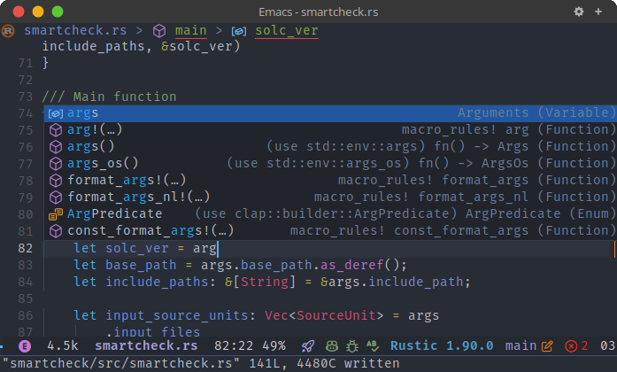

<div align="center">

# modern-icons-corfu.el

Modern icons for Emacs [corfu](https://github.com/minad/corfu).

</div>

This library integrates [modern-icons.el](https://github.com/taquangtrung/modern-icons.el) to display modern and pretty SVG icons for [corfu](https://github.com/minad/corfu) completion results in Emacs.

## Installation

From Melpa (supported soon) or manually install using [straight.el](https://github.com/radian-software/straight.el) like below:

```elisp
(use-package modern-icons
  :straight (modern-icons :type git :host github
                          :repo "taquangtrung/modern-icons-corfu.el"))
```

## Usage

Include the following code into your configuration file:

```elisp
(require 'modern-icons-corfu)
(modern-icons-corfu-enable)
```

## Screenshots

<p align="center">
  
</p>

## Acknowledgements

This library is inspired by [nerd-icons-corfu](https://github.com/LuigiPiucco/nerd-icons-corfu).
